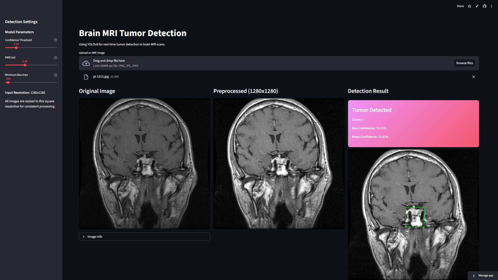

# 🧠 Brain Tumor Detection — YOLOv8

A real-time brain tumor detection web app built with YOLOv8 and Streamlit. Upload a brain MRI scan and the model detects and classifies tumors — glioma, meningioma, or pituitary — with bounding boxes and a confidence heatmap overlay.

---

## Demo



---

## Model Performance

Trained on a combined dataset of labeled MRI scans across 3 tumor classes.

| Class | Images | Instances | mAP50 | mAP50-95 | Precision | Recall |
|---|---|---|---|---|---|---|
| **All** | 435 | 329 | 0.908 | 0.504 | 0.922 | 0.863 |
| Glioma | 124 | 124 | 0.941 | 0.495 | 0.935 | 0.929 |
| Meningioma | 110 | 110 | 0.960 | 0.605 | 0.954 | 0.933 |
| Pituitary | 91 | 95 | 0.822 | 0.412 | 0.879 | 0.726 |

- **Architecture:** YOLO26n (122 layers, 2.37M parameters, 5.2 GFLOPs)
- **Input resolution:** 1280 × 1280
- **Training:** 100 epochs, patience 20, auto batch (A100 GPU)
- **Inference speed:** 0.7ms preprocess, 3.4ms inference per image
- **Framework:** Ultralytics 8.4.19, PyTorch 2.10, Python 3.12

---

## Features

- Upload any brain MRI image (PNG, JPG)
- Detects and classifies glioma, meningioma, and pituitary tumors
- Bounding box overlay with confidence scores
- Confidence heatmap with adjustable colormap and opacity
- Adjustable detection thresholds (confidence, IoU, minimum box area)
- Detection details table with coordinates and dimensions
- Inference time and detection metrics

---

## Project Structure

```
brain-tumor/
├── app.py              # Streamlit app
├── best.pt             # Trained YOLOv8 weights
├── requirements.txt    # Python dependencies
├── packages.txt        # System dependencies (Streamlit Cloud)
└── README.md
```

---

## Running Locally

```bash
# Clone the repo
git clone https://github.com/yourusername/brain-tumor.git
cd brain-tumor

# Install dependencies
pip install -r requirements.txt

# Run the app
streamlit run app.py
```

---

## Training

Training was done in Google Colab on an NVIDIA A100 GPU. Two Kaggle datasets were downloaded, merged, and split 80/20 into train/val. The `notumor` class label files were emptied so the model learns negative examples without bounding boxes.

```bash
yolo detect train \
  data=/content/brain.yaml \
  model=yolo26n.pt \
  epochs=100 \
  patience=20 \
  imgsz=1280 \
  batch=-1
```

**`brain.yaml`**
```yaml
path: /content/BrainTumorYOLO
train: images/train
val: images/val
nc: 3
names: ['glioma', 'meningioma', 'pituitary']
```

---

## Requirements

```
streamlit
numpy
Pillow
matplotlib
torch
torchvision
ultralytics
opencv-python-headless
```

**`packages.txt`** (Streamlit Cloud — Debian Trixie)
```
libgl1
libglib2.0-0t64
```

---

## Datasets

This project was trained on the following publicly available Kaggle datasets:

**Labeled MRI Brain Tumor Dataset**
> Ahmed, Ammar. *Labeled MRI Brain Tumor Dataset*. Kaggle, 2024.
> https://www.kaggle.com/datasets/ammarahmed310/labeled-mri-brain-tumor-dataset

**Medical Image Dataset — Brain Tumor Detection**
> Darabi, Pooya Karimi. *Medical Image Dataset: Brain Tumor Detection*. Kaggle, 2023.
> https://www.kaggle.com/datasets/pkdarabi/medical-image-dataset-brain-tumor-detection

---

## Disclaimer

This tool is intended for **research and educational purposes only**. It is not a medical device and should not be used for clinical diagnosis. Always consult a qualified medical professional for any health-related decisions.

---

## License

MIT License — see [LICENSE](LICENSE) for details.
